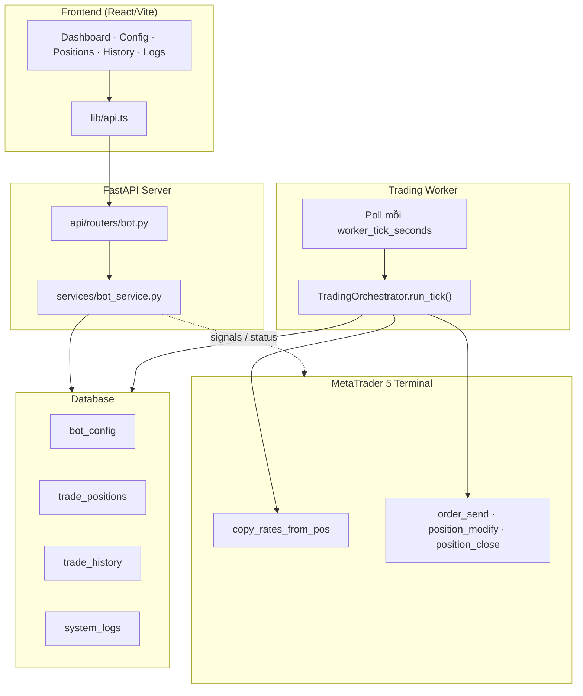
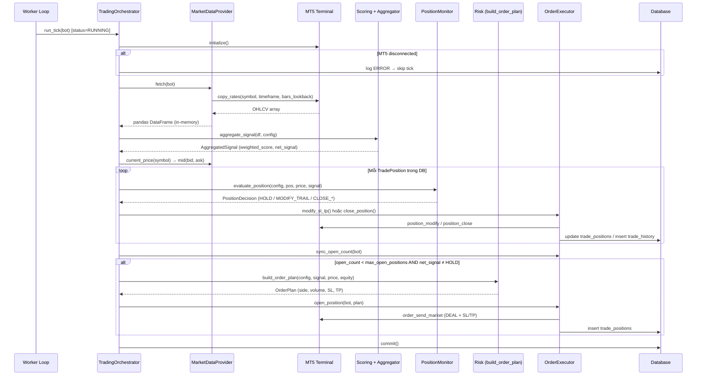
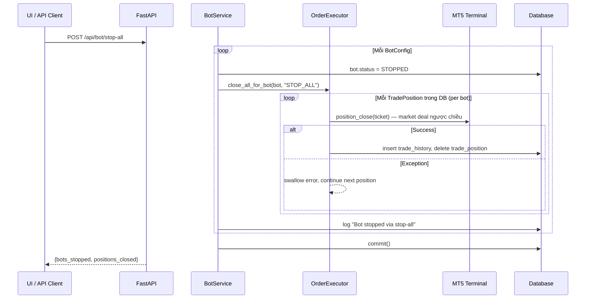

# XAUBot TradFi — Technical Specification

> **Phiên bản:** 1.0 · **Ngày:** 2025-06-05  
> **Đối tượng:** Senior Developer vận hành bot trade XAUUSD trên Bybit TradFi (MetaTrader 5)  
> **Mục tiêu tài liệu:** Giải thích chi tiết logic vận hành để dễ **Custom**, **Optimize**, hoặc **Thêm/Xóa chiến lược** mới.

---

## Mục lục

1. [Architecture Overview](#1-architecture-overview)
2. [Trading Strategies & Scoring Rules](#2-trading-strategies--scoring-rules)
3. [Order Execution & Risk Management](#3-order-execution--risk-management)
4. [Panic Button & Emergency Logic](#4-panic-button--emergency-logic)
5. [Phụ lục: File Map & Config Reference](#5-phụ-lục-file-map--config-reference)

---

## 1. Architecture Overview

### 1.1 Tổng quan hệ thống

XAUBot TradFi là hệ thống **2 process** tách biệt, chia sẻ trạng thái qua **MySQL/SQLite**:

| Process | Entry Point | Vai trò | Yêu cầu runtime |
|---------|-------------|---------|-----------------|
| **API Server** | `backend/app/main.py` | REST API cho React UI; CRUD config; dashboard; start/stop bot | Chạy được trên Linux/Docker |
| **Trading Worker** | `backend/app/worker/main.py` (`python -m app.worker`) | Poll DB mỗi N giây, thực thi pipeline giao dịch qua MT5 | **Bắt buộc Windows** + MT5 terminal mở |



> **Lưu ý quan trọng:** Không có job queue (Celery/APScheduler). Worker loop chính là **scheduler duy nhất** của hệ thống.

---

### 1.2 Data Flow — Từ nến MT5 đến quyết định giao dịch

**OHLCV không được lưu vào DB.** Mỗi tick, bot fetch nến live từ MT5 → tính toán in-memory → quyết định → ghi kết quả (position/history/log) vào DB.



#### Các bước chi tiết

| Bước | File | Hành động |
|------|------|-----------|
| 1. Poll bot RUNNING | `worker/main.py` | Query `bot_config WHERE status = RUNNING` |
| 2. Kết nối MT5 | `services/mt5_client.py` | `initialize()` — timeout `mt5_connect_timeout_ms` (mặc định 5000ms) |
| 3. Lấy nến | `trading/market_data.py` | `copy_rates_from_pos(symbol, timeframe, 0, bars_lookback)` → DataFrame |
| 4. Tính điểm chiến lược | `trading/scoring.py` | Gọi 3 strategy `evaluate()` |
| 5. Tổng hợp tín hiệu | `trading/aggregator.py` | Weighted sum + threshold gate → BUY/SELL/HOLD |
| 6. Giá hiện tại | `trading/market_data.py` | `mid = (bid + ask) / 2` |
| 7. Quản lý vị thế mở | `trading/position_monitor.py` | SL → TP → Trailing → Signal reversal |
| 8. Vào lệnh mới | `trading/risk.py` + `trading/execution.py` | Chỉ khi `open_count == 0` và signal ≠ HOLD |
| 9. Persist | `models.py` | `trade_positions`, `trade_history`, `system_logs` |

#### Luồng điều khiển từ UI

| Hành động UI | API | Ảnh hưởng |
|--------------|-----|-----------|
| **Bật bot** | `POST /api/bot/{id}/start` | `status = RUNNING` → worker bắt đầu tick |
| **Dừng bot** | `POST /api/bot/{id}/stop` | `status = STOPPED` → worker bỏ qua; **không đóng lệnh** |
| **Stop All** | `POST /api/bot/stop-all` | Dừng tất cả bot + đóng toàn bộ vị thế market |
| **Debug signal** | `GET /api/bot/signals/{bot_id}` | Tính signal live, **không giao dịch** |

---

### 1.3 Database Schema (4 bảng)

| Bảng | Model | Lưu gì |
|------|-------|--------|
| `bot_config` | `BotConfig` | Cấu hình bot, weights, threshold, risk params |
| `trade_positions` | `TradePosition` | Vị thế đang mở (sync khi open/modify/close) |
| `trade_history` | `TradeHistory` | Vị thế đã đóng + P&L + close_reason |
| `system_logs` | `SystemLog` | Log hoạt động, lỗi MT5, lỗi orchestrator |

> **Gap thiết kế:** Không có bảng lưu nến OHLCV. Không có đồng bộ định kỳ MT5 ↔ DB (chỉ write-on-action).

---

## 2. Trading Strategies & Scoring Rules

### 2.1 Kiến trúc Strategy Layer

```
trading/
├── indicators/          # Pure math trên OHLCV (không biết về scoring)
│   ├── donchian.py
│   ├── supertrend.py
│   └── rsi_divergence.py
├── strategies/          # Map indicator → score {-1, 0, +1}
│   ├── donchian_strategy.py
│   ├── supertrend_strategy.py
│   └── rsi_divergence_strategy.py
├── scoring.py           # Orchestrator: gọi tất cả strategies
├── aggregator.py        # Weighted sum + threshold
└── types.py             # StrategyResult, AggregatedSignal, NetSignal
```

**Hiện tại có 3 chiến lược** (không có chiến lược thứ 4 trong codebase). Mỗi strategy expose hàm:

```python
def evaluate(df: pd.DataFrame, config: BotConfig) -> StrategyResult
```

> **Không có Base Class / Protocol / Plugin Registry.** Convention là functional module + manual wiring trong `scoring.py` và `aggregator.py`.

---

### 2.2 Chi tiết từng chỉ báo & quy tắc chấm điểm

#### Bảng tóm tắt nhanh

| Strategy | Loại | Score có thể | Config params |
|----------|------|--------------|---------------|
| **Donchian** | Breakout | `-1`, `0`, `+1` | `donchian_period`, `donchian_weight` |
| **SuperTrend** | Trend-following | `-1`, `+1`, **`±0.5`** (khi flip) | `supertrend_period`, `supertrend_multiplier`, `supertrend_weight` |
| **RSI Divergence** | Reversal | `-1`, `0`, `+1` | `rsi_period`, `rsi_overbought`, `rsi_oversold`, `rsi_swing_lookback`, `rsi_weight` |

---

#### 2.2.1 Donchian Channel — Breakout

**Indicator** (`trading/indicators/donchian.py`):

```
dc_upper[t] = MAX(high, period)
dc_lower[t] = MIN(low, period)
dc_mid[t]   = (dc_upper + dc_lower) / 2
```

**Scoring** (`trading/strategies/donchian_strategy.py`):

| Điều kiện | Score | Ghi chú |
|-----------|-------|---------|
| `len(data) < donchian_period + 2` | **0** | `insufficient_data` |
| `close[-1] > dc_upper[-2]` | **+1** | Bullish breakout — so sánh với **nến trước** |
| `close[-1] < dc_lower[-2]` | **-1** | Bearish breakout |
| Còn lại | **0** | Trong channel |

> **Thiết kế có chủ ý:** Dùng band của nến `[-2]` (không phải `[-1]`) để tránh look-ahead bias. Trade-off: tín hiệu breakout chậm hơn 1 bar.

**Ví dụ** (period=20, weight=0.35):

```
close = 2350.50, upper_prev = 2348.00 → score = +1.0
close = 2340.00, lower_prev = 2342.00 → score = -1.0
close = 2345.00 (trong channel)       → score = 0.0
```

---

#### 2.2.2 SuperTrend — Trend Following

**Indicator** (`trading/indicators/supertrend.py`):

1. **ATR** = rolling mean của True Range (period bars)
2. `basic_ub = hl2 + multiplier × ATR`
3. `basic_lb = hl2 - multiplier × ATR`
4. **Final bands** được smooth bar-by-bar (carry forward khi giá không phá band cũ)
5. `st_direction`: **+1** = uptrend, **-1** = downtrend
6. `st_value` = `final_lb` nếu uptrend, `final_ub` nếu downtrend

**Scoring** (`trading/strategies/supertrend_strategy.py`):

| Bước | Logic | Score |
|------|-------|-------|
| 1 | `st_direction` toàn NaN | **0** |
| 2 | `direction[-1] == +1` | base = **+1.0** |
| 3 | `direction[-1] == -1` | base = **-1.0** |
| 4 | `direction[-1] ≠ direction[-2]` (vừa flip trend) | score = **0.5 × base** → **±0.5** |

> **Điểm đặc biệt:** SuperTrend là strategy **duy nhất** có score phân số (±0.5). Điều này có thể ngăn weighted score vượt threshold ngay sau khi trend đảo chiều.

**Ví dụ** (period=10, multiplier=3.0, weight=0.35):

```
direction = +1, không flip  → score = +1.0
direction = -1, không flip  → score = -1.0
direction = +1, vừa flip từ -1 → score = +0.5
```

---

#### 2.2.3 RSI Divergence — Reversal

**RSI** (`trading/indicators/rsi_divergence.py`):

```
RSI = 100 - (100 / (1 + RS))
RS  = avg_gain / avg_loss  (rolling mean, period bars)
```

**Swing detection:** Local min/max trong cửa sổ `swing_lookback` (centered window).

**Divergence rules** (`detect_divergence`):

| Loại | Điều kiện (2 swing gần nhất) | Filter RSI |
|------|------------------------------|------------|
| **Bullish** | Giá: lower low (`p2 < p1`) AND RSI: higher low (`r2 > r1`) | `last_rsi ≤ oversold + 10` |
| **Bearish** | Giá: higher high (`p2 > p1`) AND RSI: lower high (`r2 < r1`) | `last_rsi ≥ overbought - 10` |
| **None** | Không thỏa hoặc `len(df) < rsi_period + swing_lookback × 4` | — |

> Bearish được check **sau** bullish — nếu cả hai match, bearish ghi đè.

**Scoring** (`trading/strategies/rsi_divergence_strategy.py`):

| `div_type` | Score |
|------------|-------|
| `bullish` | **+1.0** |
| `bearish` | **-1.0** |
| `none` | **0.0** |

**Ví dụ** (rsi_period=14, oversold=30, overbought=70, swing_lookback=5, weight=0.30):

```
Bullish div, last_rsi=38 (≤ 40)  → score = +1.0
Bearish div, last_rsi=65 (≥ 60)  → score = -1.0
Không có divergence              → score = 0.0
```

---

### 2.3 Net Score — Công thức tổng hợp & Threshold

**File:** `trading/aggregator.py` → `aggregate_signal()`

#### Công thức Weighted Score

```
weighted_score = donchian_weight   × donchian_score
               + supertrend_weight × supertrend_score
               + rsi_weight        × rsi_divergence_score
```

> Thứ tự strategy **hardcoded theo index** trong `scoring.py` (không lookup theo tên).

#### Gate Threshold → Net Signal

| Điều kiện | `net_signal` | Ý nghĩa |
|-----------|--------------|---------|
| `weighted_score ≥ signal_threshold` | **+1** (BUY) | Mở lệnh BUY (nếu flat) |
| `weighted_score ≤ -signal_threshold` | **-1** (SELL) | Mở lệnh SELL (nếu flat) |
| Còn lại | **0** (HOLD) | Không vào lệnh mới |

#### Ví dụ tính toán (defaults từ seed)

| Tham số | Giá trị |
|---------|---------|
| `donchian_weight` | 0.35 |
| `supertrend_weight` | 0.35 |
| `rsi_weight` | 0.30 |
| `signal_threshold` | 0.65 |

| Scenario | Donchian | SuperTrend | RSI | Weighted | Net |
|----------|----------|------------|-----|----------|-----|
| Đồng thuận bull | +1.0 | +1.0 | +1.0 | **1.00** | **BUY** |
| Trend bull, no div | +1.0 | +1.0 | 0.0 | **0.70** | **BUY** |
| ST vừa flip bull | +1.0 | +0.5 | 0.0 | **0.525** | **HOLD** |
| Mixed weak | +1.0 | 0.0 | -1.0 | **0.05** | **HOLD** |
| Đồng thuận bear | -1.0 | -1.0 | -1.0 | **-1.00** | **SELL** |

> **Validation:** API bắt buộc `donchian_weight + supertrend_weight + rsi_weight = 1.0` (tolerance `1e-6`) khi update config qua `BotService.validate_weights()`.

#### Threshold tái sử dụng cho Exit

`position_monitor.py` đóng vị thế khi **signal đảo chiều** chỉ khi:

```
opposite_signal AND |weighted_score| ≥ signal_threshold
```

Cùng ngưỡng với entry gate — đảm bảo exit chỉ khi tín hiệu đủ mạnh.

---

### 2.4 Hướng dẫn thêm / xóa Strategy mới

#### Thêm strategy mới (ví dụ: MACD)

| # | File | Hành động |
|---|------|-----------|
| 1 | `trading/indicators/macd.py` | Implement indicator math (tuân convention hiện có) |
| 2 | `trading/strategies/macd_strategy.py` | `evaluate(df, config) → StrategyResult` với score ∈ [-1, 0, +1] |
| 3 | `trading/scoring.py` | Import + append vào list return |
| 4 | `trading/aggregator.py` | Thêm `config.macd_weight * results[N].score` vào weighted sum |
| 5 | `models.py` (`BotConfig`) | Thêm `macd_*` params + `macd_weight` column |
| 6 | `schemas.py` | Thêm fields vào `BotConfigRead` / `BotConfigUpdate` |
| 7 | `database.py` | Migration cho columns mới |
| 8 | `services/bot_service.py` | Cập nhật `validate_weights()` (tổng = 1.0) |
| 9 | `seed.py` | Default values cho bot mới |
| 10 | `frontend/src/lib/types.ts` + `BotConfigPage.tsx` | UI fields |
| 11 | `tests/test_aggregator.py` | Cập nhật test |

#### Xóa strategy

1. Xóa/comment module trong `scoring.py` và `aggregator.py`
2. Redistribute weights của strategy bị xóa sang các strategy còn lại
3. Giữ hoặc drop DB columns (khuyến nghị: giữ để backward-compatible)

#### Contract `StrategyResult`

```python
@dataclass
class StrategyResult:
    name: str          # e.g. "donchian"
    score: float       # -1.0 .. +1.0 (SuperTrend có thể ±0.5)
    raw: dict          # Debug metadata (close, direction, rsi, ...)
```

> **Không cần kế thừa class nào.** Chỉ cần tuân function signature và return type trên.

---

## 3. Order Execution & Risk Management

### 3.1 Pipeline thực thi lệnh

```
TradingOrchestrator.run_tick()
    ├── [1] Monitor open positions (ưu tiên trước entry)
    └── [2] Entry mới (chỉ khi flat)
```

File trung tâm: `services/trading_orchestrator.py`

---

### 3.2 Entry Conditions — Checklist trước khi bắn lệnh MT5

#### ✅ Điều kiện ĐÃ implement

| # | Check | File | Rule |
|---|-------|------|------|
| 1 | Bot RUNNING | `trading_orchestrator.py` | `bot.status == RUNNING` |
| 2 | MT5 connected | `trading_orchestrator.py` | `mt5.initialize().connected == True` |
| 3 | Market data OK | `market_data.py` | DataFrame không empty; raise nếu fail |
| 4 | Signal ≠ HOLD | `aggregator.py` | `net_signal ∈ {+1, -1}` |
| 5 | Chưa đạt max positions | `execution.py` | `sync_open_count(bot) < max_open_positions` |
| 6 | Flat (no open pos) | `trading_orchestrator.py` | `open_count == 0` — chỉ 1 vị thế/bot (default) |
| 7 | Valid order plan | `risk.py` | `volume > 0`, signal ≠ HOLD |
| 8 | MT5 symbol resolve | `mt5_client.py` | Fallback: `XAUUSD+` → `XAUUSD` → variants |
| 9 | Volume clamp | `mt5_client.py` | `volume_min ≤ vol ≤ volume_max`, round theo `volume_step` |
| 10 | Order retcode | `mt5_client.py` | `TRADE_RETCODE_DONE` mới coi thành công |

#### ❌ Điều kiện CHƯA implement

| Check | Trạng thái | Rủi ro |
|-------|-----------|--------|
| **Spread filter** | Không có | Vào lệnh khi spread rộng |
| **Free margin / balance gate** | Không có | Equity chỉ dùng cho sizing, không validate margin |
| **Duplicate order vs MT5** | Chỉ đếm DB rows | DB/MT5 có thể lệch nếu manual trade |
| **Pending order dedup** | N/A | Bot chỉ dùng **market orders** |
| **Circuit breaker** | Không có | Không auto-stop khi loss streak |
| **Max daily loss** | Không có | — |

> **Khuyến nghị custom:** Thêm spread check trong `build_order_plan()` hoặc đầu `run_tick()` nếu cần production-hardening.

---

### 3.3 Chi tiết MT5 Market Order

**File:** `services/mt5_client.py` → `order_send_market()`

| Param | Giá trị |
|-------|---------|
| Action | `TRADE_ACTION_DEAL` (market) |
| Price | BUY → `tick.ask`, SELL → `tick.bid` |
| SL/TP | Gắn ngay trên deal |
| Deviation | 20 points |
| Filling | `ORDER_FILLING_IOC` |
| Time | `ORDER_TIME_GTC` |
| Magic | `config.magic_number` (default 202501) |
| Comment | `XAUBot-{bot.name}` |

**Entry price dùng cho sizing/plan:** `mid = (bid + ask) / 2` — nhưng lệnh thực tế khớp ở ask/bid.

---

### 3.4 Position Sizing — Công thức tính Lot

**File:** `trading/risk.py` → `_calculate_volume()`

#### Bước 1: Tính khoảng cách SL

```
sl_distance = entry_price × (stop_loss_pct / 100)
```

| Side | SL Price | TP Price |
|------|----------|----------|
| BUY | `entry - sl_distance` | `entry + tp_distance` |
| SELL | `entry + sl_distance` | `entry - tp_distance` |

(`tp_distance` tương tự với `take_profit_pct`)

#### Bước 2: Risk amount

```
risk_amount = equity × (risk_per_trade_pct / 100)
```

- `equity` = `mt5.account_info().equity` tại thời điểm entry
- Default `risk_per_trade_pct` = **1.0%**

#### Bước 3: Volume

**Preferred path** (có MT5 symbol info):

```
ticks      = sl_distance / trade_tick_size
volume     = risk_amount / (ticks × trade_tick_value)
```

**Fallback** (không có symbol info):

```
volume = risk_amount / (sl_distance × 100)    # heuristic XAUUSD
```

#### Bước 4: Clamp

```
volume = clamp(volume, volume_min, volume_max)
volume = round(volume / volume_step) × volume_step
```

#### Edge cases

| Case | Behavior |
|------|----------|
| `equity ≤ 0` hoặc `sl_distance ≤ 0` | Return **0.01** lots (không block entry) |
| `volume ≤ 0` sau tính | `build_order_plan()` return `None` → không vào lệnh |

#### Ví dụ số

```
equity          = $10,000
risk_per_trade  = 1.0%  → risk_amount = $100
entry_price     = $2,350
stop_loss_pct   = 0.6%  → sl_distance = $14.10
trade_tick_size = 0.01, tick_value = $0.01 (giả định broker)

ticks  = 14.10 / 0.01 = 1410
volume = 100 / (1410 × 0.01) ≈ 7.09 lots → clamp theo broker rules
```

---

### 3.5 TP, SL & Trailing Stop

#### Dual-layer protection

Bot dùng **2 lớp** bảo vệ đồng thời:

1. **Broker-side SL/TP** — gắn khi `order_send_market()`, MT5 tự execute
2. **Software monitor** — `position_monitor.py` check mỗi worker tick bằng mid-price

#### Thứ tự đánh giá mỗi tick (`evaluate_position`)

```mermaid
flowchart TD
    A[Update extreme price] --> B{SL hit?}
    B -->|Yes| C[CLOSE_SL]
    B -->|No| D{TP hit?}
    D -->|Yes| E[CLOSE_TP]
    D -->|No| F{Trailing enabled?}
    F -->|Yes| G{Tính new_sl}
    G -->|Price breach new_sl| H[CLOSE_TRAIL]
    G -->|new_sl > current_sl| I[MODIFY_TRAIL → MT5]
    G -->|No change| J
    F -->|No| J{Opposite signal?}
    J -->|Yes + |score| ≥ threshold| K[CLOSE_SIGNAL]
    J -->|No| L[HOLD]
```

| Priority | Action | Điều kiện (BUY example) |
|----------|--------|-------------------------|
| 1 | `CLOSE_SL` | `current_price ≤ current_sl` |
| 2 | `CLOSE_TP` | `current_price ≥ current_tp` |
| 3 | `CLOSE_TRAIL` | Trailing enabled + price breach computed trail SL |
| 4 | `MODIFY_TRAIL` | Trailing enabled + new SL tốt hơn (dời SL lên) |
| 5 | `CLOSE_SIGNAL` | Signal SELL + `|weighted_score| ≥ threshold` |
| 6 | `HOLD` | Không action |

#### Trailing Stop — Công thức

**File:** `trading/risk.py` → `trailing_sl_price()`

```
trail_distance = extreme_price × (trailing_stop_pct / 100)
```

| Side | Extreme tracked | New SL | Rule |
|------|-----------------|--------|------|
| BUY | `highest_price` (running max) | `extreme - trail_distance` | Chỉ dời SL **lên** (new_sl > current_sl) |
| SELL | `lowest_price` (running min) | `extreme + trail_distance` | Chỉ dời SL **xuống** (new_sl < current_sl) |

> **Quan trọng:** Trailing chạy theo **worker tick** (~5 giây), **không phải per-candle**. Dùng mid-price, không đợi nến đóng.

**Ví dụ BUY** (trailing_stop_pct=0.4%, entry=2350):

```
Tick 1: price=2355 → highest=2355 → trail_dist=9.42 → new_sl=2345.58
Tick 2: price=2360 → highest=2360 → trail_dist=9.44 → new_sl=2350.56 → MODIFY_TRAIL
Tick 3: price=2348 → price ≤ new_sl(2350.56)? No (2348 < 2350.56) → CLOSE_TRAIL
```

#### P&L khi đóng lệnh

**File:** `trading/execution.py` → `close_position()`

```
BUY:  PnL = (exit_price - entry_price) × volume × 100
SELL: PnL = (entry_price - exit_price) × volume × 100
```

> Multiplier `× 100` hardcoded cho XAUUSD-like contracts. Custom instrument cần sửa tại đây.

---

## 4. Panic Button & Emergency Logic

### 4.1 Stop All — Luồng xử lý khẩn cấp

#### API Endpoint

```
POST /api/bot/stop-all
```

**File:** `api/routers/bot.py` → `BotService.stop_all()`



#### Thứ tự thực thi chi tiết

| Step | Hành động | Ghi chú |
|------|-----------|---------|
| 1 | Query **tất cả** `BotConfig` | Không filter RUNNING — stop cả bot đã STOPPED |
| 2 | Set `status = STOPPED` cho từng bot | Worker sẽ bỏ qua ở tick tiếp theo |
| 3 | Query `trade_positions WHERE bot_id = ?` | Chỉ đóng positions **tracked trong DB** |
| 4 | `position_close(ticket)` trên MT5 | Market order ngược chiều, `ORDER_FILLING_IOC` |
| 5 | Ghi `trade_history` với `close_reason = "STOP_ALL"` | |
| 6 | Xóa row `trade_positions` | |
| 7 | `commit()` toàn bộ | |

#### Những gì Stop All **KHÔNG** làm

| Hành động | Trạng thái |
|-----------|-----------|
| Hủy **pending orders** (limit/stop) | ❌ Không implement — bot không tạo pending orders |
| Đóng positions **không có trong DB** (manual trades) | ❌ Không reconcile MT5 |
| Retry khi close fail | ❌ Exception bị `continue` — silent skip |
| Notify UI chi tiết lỗi từng ticket | ❌ Chỉ trả tổng `positions_closed` |

#### So sánh Stop vs Stop All

| | `POST /{id}/stop` | `POST /stop-all` |
|--|-------------------|------------------|
| Đổi status | STOPPED (1 bot) | STOPPED (tất cả) |
| Đóng vị thế | ❌ Không | ✅ Tất cả (per DB) |
| UI wired | ✅ `BotConfigPage` | ❌ Chưa có trong `api.ts` |

> **Frontend gap:** `frontend/src/lib/api.ts` chưa expose `stopAll()`. Cần gọi trực tiếp API hoặc thêm wrapper + Panic Button trên UI.

---

### 4.2 Worker behavior khi Stop All

- Worker poll mỗi `worker_tick_seconds` (default **5s**)
- Sau `stop-all`, bot `STOPPED` → `run_tick()` return `{"skipped": true}` ngay ở check đầu
- **Race condition window:** Nếu worker đang trong `run_tick()` khi stop-all chạy, có thể có 1 tick overlap. Mitigate bằng việc stop-all đóng positions trực tiếp qua MT5

---

### 4.3 Circuit Breaker & Error Handling

#### Circuit Breaker tự động

| Feature | Trạng thái |
|---------|-----------|
| Consecutive loss limit | ❌ Không có |
| Daily drawdown cap | ❌ Không có |
| Error rate throttle | ❌ Không có |
| Auto stop-all on N failures | ❌ Không có |

#### MT5 Disconnect Handling

| Context | Behavior |
|---------|----------|
| **Worker startup** | `initialize()` fail → `sys.exit(1)` — worker **chết** |
| **Per-tick (trading)** | `initialize()` fail → log ERROR, skip tick, **loop tiếp tục** |
| **API status check** | Subprocess probe, timeout `mt5_connect_timeout_ms/1000 + 3` ≈ **8s** |
| **API cache** | Kết quả status cache **15 giây** (`_STATUS_CACHE_TTL_SEC`) |
| **Reconnect** | Mỗi tick gọi lại `initialize()` — không có backoff/retry policy |
| **DB↔MT5 sync** | ❌ Không reconcile khi reconnect |

#### API Timeout

| Layer | Timeout |
|-------|---------|
| MT5 subprocess probe | ~8s wall timeout |
| Frontend `fetch()` | ❌ Không set client timeout |
| FastAPI middleware | ❌ Không có global request timeout |

#### Exception handling trong tick

```python
# trading_orchestrator.py
except Exception as exc:
    logger.exception(...)
    log_message(db, str(exc), level=ERROR, source="orchestrator")
    db.commit()
    return {**meta, "error": str(exc)}
```

> Lỗi 1 tick **không dừng worker**. Bot tiếp tục tick tiếp theo trừ khi MT5 fail liên tục (vẫn loop, chỉ skip).

#### Graceful shutdown

- `SIGINT` / `SIGTERM` → `_running = False`
- Worker gọi `mt5.shutdown()` trước khi exit

---

### 4.4 Khuyến nghị hardening (chưa có — để custom)

| Feature | Gợi ý implement tại |
|---------|---------------------|
| Circuit breaker | `trading_orchestrator.py` — check daily P&L từ `trade_history` |
| Spread filter | `risk.py` hoặc `run_tick()` — `if (ask-bid) > max_spread: skip` |
| MT5↔DB reconcile | New service — `positions_get(magic)` vs DB mỗi N ticks |
| Panic Button UI | `frontend` — gọi `POST /api/bot/stop-all` |
| Pending order cancel | `mt5_client.py` — `orders_get()` + cancel trong `stop_all()` |
| Failed close retry | `execution.py` — retry 3x trước khi log ERROR |

---

## 5. Phụ lục: File Map & Config Reference

### 5.1 File Map theo concern

| Concern | Files |
|---------|-------|
| **Orchestration** | `services/trading_orchestrator.py`, `worker/main.py` |
| **Market Data** | `trading/market_data.py`, `services/mt5_client.py` |
| **Strategies** | `trading/strategies/*.py`, `trading/indicators/*.py` |
| **Scoring** | `trading/scoring.py`, `trading/aggregator.py`, `trading/types.py` |
| **Risk** | `trading/risk.py` |
| **Execution** | `trading/execution.py`, `services/mt5_client.py` |
| **Position Mgmt** | `trading/position_monitor.py` |
| **Config/DB** | `models.py`, `schemas.py`, `seed.py`, `services/bot_service.py` |
| **API** | `api/routers/bot.py` |
| **Frontend** | `frontend/src/lib/api.ts`, `frontend/src/pages/BotConfigPage.tsx` |

### 5.2 BotConfig — Tham số mặc định (seed)

| Nhóm | Field | Default (seed) | Mô tả |
|------|-------|----------------|-------|
| Market | `symbol` | `XAUUSD+` | Symbol MT5 |
| | `timeframe` | `M15` | Khung thời gian |
| | `bars_lookback` | `500` | Số nến fetch mỗi tick |
| Risk | `risk_per_trade_pct` | `1.0` | % equity risk mỗi lệnh |
| | `max_open_positions` | `1` | Max vị thế đồng thời |
| | `magic_number` | `202501` | MT5 magic filter |
| Exit | `stop_loss_pct` | `0.6` | SL distance % |
| | `take_profit_pct` | `1.2` | TP distance % |
| | `trailing_stop_enabled` | `true` | Bật trailing |
| | `trailing_stop_pct` | `0.4` | Trail distance % từ extreme |
| Donchian | `donchian_period` | `20` | Channel period |
| | `donchian_weight` | `0.35` | Trọng số |
| SuperTrend | `supertrend_period` | `10` | ATR period |
| | `supertrend_multiplier` | `3.0` | Band multiplier |
| | `supertrend_weight` | `0.35` | Trọng số |
| RSI | `rsi_period` | `14` | RSI length |
| | `rsi_overbought` | `70.0` | Bearish div filter |
| | `rsi_oversold` | `30.0` | Bullish div filter |
| | `rsi_swing_lookback` | `5` | Swing window |
| | `rsi_weight` | `0.30` | Trọng số |
| Gate | `signal_threshold` | `0.65` | Ngưỡng BUY/SELL |

### 5.3 Environment Variables (`.env`)

| Variable | Default | Mô tả |
|----------|---------|-------|
| `DATABASE_URL` | MySQL localhost | Connection string |
| `WORKER_TICK_SECONDS` | `5` | Worker poll interval |
| `MT5_CONNECT_TIMEOUT_MS` | `5000` | MT5 init timeout |
| `MT5_PATH` | — | Đường dẫn terminal MT5 |
| `MT5_LOGIN` / `PASSWORD` / `SERVER` | — | Credentials (optional nếu GUI đã login) |
| `CORS_ORIGINS` | `localhost:3000` | Frontend origins |

### 5.4 Quick Reference — Close Reasons

| `close_reason` | Trigger |
|----------------|---------|
| `SL` | Software monitor: price hit stop loss |
| `TP` | Software monitor: price hit take profit |
| `TRAIL` | Trailing stop breached |
| `SIGNAL` | Opposite signal ≥ threshold |
| `STOP_ALL` | Emergency stop-all API |

---

*Tài liệu được sinh từ phân tích source code tại `D:/Bot`. Cập nhật khi thay đổi kiến trúc hoặc thêm strategy mới.*
