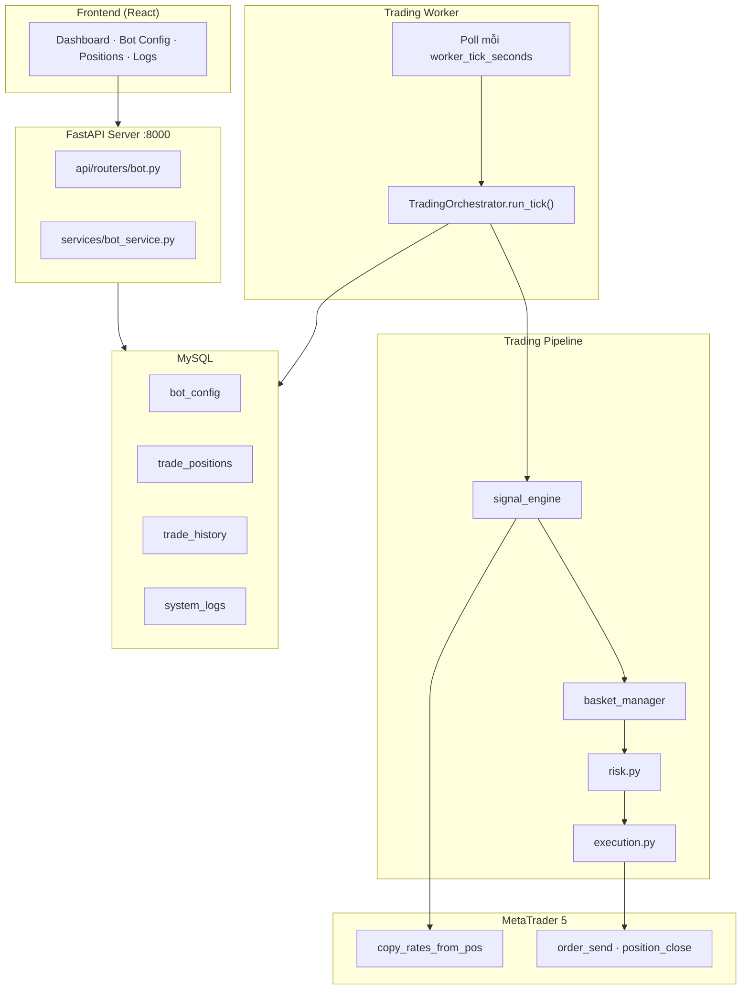
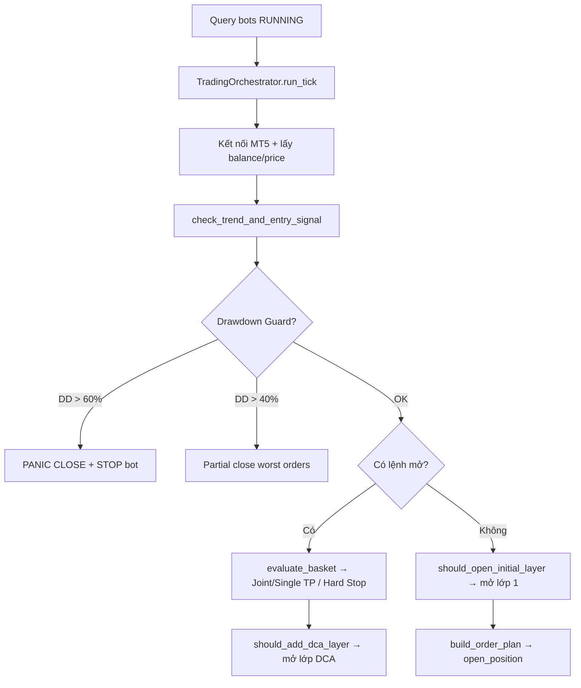

# XAUBot TradFi — Technical Overview

> **Phiên bản:** 2.0 (Scalping H1/M5) · **Cập nhật:** 2026-06-08  
> **Đối tượng:** Developer vận hành, maintain và mở rộng hệ thống  
> **Phạm vi:** Backend trading pipeline + Worker + MT5 execution

---

## Mục lục

1. [Tổng quan hệ thống](#1-tổng-quan-hệ-thống)
2. [Kiến trúc & luồng dữ liệu](#2-kiến-trúc--luồng-dữ-liệu)
3. [Worker tick pipeline](#3-worker-tick-pipeline)
4. [Chiến lược & cách tính điểm](#4-chiến-lược--cách-tính-điểm)
5. [Signal Engine — H1 Trend + M5 Entry](#5-signal-engine--h1-trend--m5-entry)
6. [Volume & quản lý vốn](#6-volume--quản-lý-vốn)
7. [Take Profit / Stop Loss / Thoát lệnh](#7-take-profit--stop-loss--thoát-lệnh)
8. [DCA Basket (multi-layer)](#8-dca-basket-multi-layer)
9. [Drawdown Guard](#9-drawdown-guard)
10. [Cấu hình BotConfig](#10-cấu-hình-botconfig)
11. [File map & hướng dẫn mở rộng](#11-file-map--hướng-dẫn-mở-rộng)

---

## 1. Tổng quan hệ thống

XAUBot TradFi là hệ thống bot trade **XAUUSD** trên **Bybit TradFi (MetaTrader 5)** với chiến lược **scalping đa khung thời gian**:

| Khung | Vai trò |
|-------|---------|
| **H1** | Xác định xu hướng chính (`main_trend`) — chỉ dùng Donchian + SuperTrend |
| **M5** | Tìm điểm vào lệnh — dùng đủ 4 chỉ báo + bộ lọc ATR |

Hệ thống gồm **3 process** độc lập, chia sẻ trạng thái qua **MySQL**:

| Process | Entry point | Vai trò |
|---------|-------------|---------|
| **API Server** | `uvicorn app.main:app` | REST API cho React UI; CRUD config; start/stop bot |
| **Trading Worker** | `python -m app.worker` | Poll DB mỗi N giây, thực thi pipeline giao dịch qua MT5 |
| **Frontend UI** | `npm run dev` (Vite) | Dashboard, config, positions, history, logs |

> **Lưu ý:** Worker **bắt buộc chạy trên Windows** với MT5 terminal đã đăng nhập. API/UI có thể chạy Docker hoặc local.

---

## 2. Kiến trúc & luồng dữ liệu



**Nguyên tắc quan trọng:**

- **OHLCV không lưu DB.** Mỗi tick fetch nến live từ MT5 → tính toán in-memory → ghi position/history/log.
- **Không có job queue.** Worker loop là scheduler duy nhất.
- Bot chỉ trade khi `bot_config.status = RUNNING`.

---

## 3. Worker tick pipeline

Mỗi `worker_tick_seconds` (mặc định 5s), worker thực hiện:



**Thứ tự ưu tiên trong một tick:**

1. Drawdown emergency (panic / partial close)
2. Đóng basket (hard stop → joint TP → single scalp TP)
3. Nhồi DCA layer mới
4. Mở lớp 1 (nếu flat + có tín hiệu)

**Log worker** (`app/worker/tick_log.py`) in ra mỗi tick:

```
bot_id=1 | price=4320.26 | open=0 | floating_pnl=+0.00 USD | DD=0.0% | balance=200
  trend=BEARISH (H1) | allowed=SHORT | H1 score=-1.00 net=SELL
  entry M5 | net_signal=HOLD (raw=HOLD) | score=-0.03 (need >=0.65 LONG / <=-0.65 SHORT)
  filter: H1 BEARISH | M5 Score: -0.03 -> BLOCKED (counter-trend or below threshold)
```

---

## 4. Chiến lược & cách tính điểm

Hệ thống dùng **4 chiến lược độc lập**, mỗi chiến lược trả về `score ∈ [-1.0, +1.0]`.

| # | Strategy | File | Score logic (tóm tắt) |
|---|----------|------|------------------------|
| 1 | **Donchian** | `strategies/donchian_strategy.py` | `+1` breakout upper / pullback long; `-1` breakout lower / pullback short; `0` neutral |
| 2 | **SuperTrend** | `strategies/supertrend_strategy.py` | `+1` uptrend; `-1` downtrend; giảm 50% khi vừa đổi chiều |
| 3 | **RSI Midline** | `strategies/rsi_midline_strategy.py` | Bias theo RSI(14) quanh mức 50: `<45 → -1`, `>55 → +1`, vùng 45–55 gradient |
| 4 | **EMA21** | `strategies/ema_strategy.py` | `+1` close > EMA; `-1` close < EMA; `0` nếu sideway (nhiều cross EMA trong 10 nến) |

> `rsi_divergence_strategy.py` tồn tại nhưng **không được gọi** trong pipeline hiện tại.

### 4.1 Tổng hợp điểm (Aggregator)

File: `app/trading/aggregator.py`

**Entry score (M5)** — dùng cả 4 chỉ báo:

```
raw_score = donchian_weight × Donchian
          + supertrend_weight × SuperTrend
          + rsi_weight        × RSI
          + ema_weight        × EMA21

# ATR dampen (chỉ M5 entry):
if ATR_hiện_tại < ATR_trung_bình_20_nến:
    raw_score ×= 0.5    # giảm tín hiệu khi thị trường sideway / volatility thấp

entry_score = round(raw_score, 4)
```

**Trend score (H1)** — chỉ Donchian + SuperTrend, renormalize:

```
trend_weight = donchian_weight + supertrend_weight   # mặc định 0.65
h1_score = (donchian_weight/trend_weight) × Donchian
         + (supertrend_weight/trend_weight) × SuperTrend
```

### 4.2 Trọng số mặc định

| Tham số | Giá trị mặc định |
|---------|------------------|
| `donchian_weight` | 0.35 |
| `supertrend_weight` | 0.30 |
| `rsi_weight` | 0.20 |
| `ema_weight` | 0.15 |
| **Tổng** | **1.00** |

### 4.3 Ngưỡng tín hiệu (threshold)

| Ngữ cảnh | Công thức ngưỡng |
|----------|------------------|
| M5 entry | `signal_threshold` (mặc định **0.65**) |
| H1 trend | `signal_threshold × (donchian_weight + supertrend_weight)` ≈ **0.4225** |

Quy tắc chuyển score → `net_signal`:

```
if score >= threshold  → BUY  (+1)
if score <= -threshold → SELL (-1)
else                   → HOLD (0)
```

---

## 5. Signal Engine — H1 Trend + M5 Entry

File chính: `app/trading/signal_engine.py`

### 5.1 Luồng xử lý

```
Bước 1: Fetch H1 → aggregate_signal(include_rsi=False) → h1_net, h1_score
Bước 2: _resolve_main_trend(h1_net) → main_trend, allowed_nets
Bước 3: Fetch M5 → aggregate_signal(apply_atr_filter=True) → entry_net_raw, entry_score
Bước 4: _filter_entry_signal() → net_signal cuối, is_scalp_mode
```

### 5.2 Main Trend (từ H1)

| H1 net_signal | main_trend | allowed_nets | trend_source |
|---------------|------------|--------------|--------------|
| BUY (+1) | BULLISH | chỉ LONG | `H1` |
| SELL (-1) | BEARISH | chỉ SHORT | `H1` |
| HOLD (0) | NEUTRAL | không có | `NONE` |

### 5.3 Trend Filter — `_filter_entry_signal`

Đây là lớp **quyết định có vào lệnh hay không**, sau khi M5 đã tính score.

#### Chế độ NORMAL (H1 rõ xu hướng)

| Điều kiện | Kết quả |
|-----------|---------|
| H1 BULLISH + M5 `entry_net = BUY` (score ≥ 0.65) | ✅ Vào LONG, `is_scalp_mode = False`, volume/TP **100%** |
| H1 BEARISH + M5 `entry_net = SELL` (score ≤ -0.65) | ✅ Vào SHORT, `is_scalp_mode = False`, volume/TP **100%** |
| M5 có score đủ nhưng **ngược chiều H1** | ❌ HOLD — bị chặn |

> **Ví dụ thực tế:** M5 score `+0.65` (BUY) nhưng H1 BEARISH → `net_signal = HOLD`. Score đủ ngưỡng nhưng ngược trend.

#### Chế độ SCALP (H1 NEUTRAL)

Khi H1 chưa rõ xu hướng, hệ thống **không chặn hoàn toàn** mà cho phép vào lệnh nếu M5 có tín hiệu **cực mạnh**:

| Điều kiện | Kết quả |
|-----------|---------|
| H1 NEUTRAL + M5 score ≥ **+0.8** | ✅ Vào LONG, `is_scalp_mode = True` |
| H1 NEUTRAL + M5 score ≤ **-0.8** | ✅ Vào SHORT, `is_scalp_mode = True` |
| H1 NEUTRAL + score trong khoảng 0.65–0.79 | ❌ HOLD (chưa đủ mạnh để override) |

Hằng số: `SCALP_ENTRY_THRESHOLD = 0.8` trong `signal_engine.py`.

### 5.4 Output — `TrendEntrySignal`

| Field | Mô tả |
|-------|-------|
| `net_signal` | Tín hiệu cuối sau filter (BUY/SELL/HOLD) |
| `entry_score` | Weighted score M5 |
| `h1_score` | Weighted score H1 |
| `main_trend` | BULLISH / BEARISH / NEUTRAL |
| `is_scalp_mode` | `True` nếu vào lệnh khi H1 NEUTRAL |
| `meta.filter_log` | Chuỗi log giải thích quyết định filter |

---

## 6. Volume & quản lý vốn

File: `app/trading/risk.py`

### 6.1 Công thức lot cố định

```
lot = max(0.01, floor(balance / 1000) × 0.01)
```

| Balance | Lot |
|---------|-----|
| $200 | 0.01 |
| $1,000 | 0.01 |
| $10,000 | 0.10 |

Sau đó **clamp** theo `volume_min / volume_max / volume_step` của symbol trên MT5.

### 6.2 Scalp mode — giảm volume 50%

Khi `is_scalp_mode = True` (lớp 1):

```
volume_scalp = volume_normal × SCALP_VOLUME_MULTIPLIER   # 0.5
```

### 6.3 DCA layers

- Mọi lớp DCA (layer 1, 2, …) dùng **cùng lot size** tại thời điểm mở.
- `dca_volume_multiplier` có trong `BotConfig` nhưng **chưa được dùng** trong code hiện tại.

### 6.4 Scale TP theo balance

UI config tham chiếu vốn `$200` (`base_equity_usd`). Khi balance thực tế lớn hơn, TP USD được scale:

```
scale_factor = balance / base_equity_usd        # ví dụ $10,000 / $200 = 50×
tp_usd_thực  = config_tp_usd × scale_factor     # $1 UI → $50 thực tế
```

---

## 7. Take Profit / Stop Loss / Thoát lệnh

### 7.1 Khi mở lệnh (Layer 0)

File: `risk.build_layer_plan()`

| Thành phần | Layer 0 | Layer 1+ (DCA) |
|------------|---------|----------------|
| Broker SL | ❌ Không gắn | ❌ Không gắn |
| Broker TP | ✅ Có (scalp distance) | ❌ Không gắn |

**Công thức TP distance (giá Vàng):**

```
tp_min_usd = resolve_single_tp_min(config, balance)   # scale theo balance, floor 0.01% balance
scalp_dist = max(tp_min_usd / (base_volume × 100), single_tp_distance)

# Scalp mode:
scalp_dist ×= SCALP_TP_MULTIPLIER   # 0.5 → TP gần hơn 50%

# BUY:  tp_price = entry_price + scalp_dist
# SELL: tp_price = entry_price - scalp_dist
```

> `take_profit_pct` / `stop_loss_pct` trong BotConfig **không được dùng** khi mở lệnh.

### 7.2 Khi đang giữ lệnh — Basket Exit

File: `app/trading/basket_manager.py`

Thứ tự ưu tiên (`evaluate_basket`):

| # | Điều kiện | Action | Mô tả |
|---|-----------|--------|-------|
| 1 | `adverse_distance ≥ hard_stop_adverse_distance` (35 giá) | `CLOSE_HARD_STOP` | Black swan — cắt toàn basket |
| 2 | Multi-layer + `net_pnl ≥ basket_tp_min` | `CLOSE_BASKET_TP` | Joint close khi DCA |
| 3 | Single layer + PnL hoặc price distance đạt ngưỡng | `CLOSE_SINGLE_SCALP` | Scalp TP 1 lớp |
| 4 | Không thỏa | `HOLD` | Giữ lệnh |

**Single scalp TP** (1 lớp) — đóng khi **một trong hai**:

```
net_pnl_usd ≥ resolve_single_tp_min(config, balance)
# HOẶC
price_distance ≥ single_tp_distance (mặc định 1.2 giá Vàng)
```

**Joint basket TP** (≥ 2 lớp):

```
net_pnl_usd ≥ resolve_basket_tp_min(config, balance)
# scale từ basket_tp_min_usd, floor 0.02% balance
```

### 7.3 Trailing Stop

- Tắt mặc định (`trailing_stop_enabled = False`).
- Khi bật: `risk.trailing_sl_price()` — trailing theo % từ extreme price.
- Backup close qua `position_monitor.py` nếu giá chạm broker TP trên layer 0.

### 7.4 P&L tính toán (XAUUSD)

```
PnL_USD ≈ (price_diff) × volume × 100
```

Ví dụ: 0.01 lot, giá tăng 1.2 USD → PnL ≈ $1.20.

---

## 8. DCA Basket (multi-layer)

### 8.1 Khái niệm

Các lệnh cùng chiều (BUY hoặc SELL) được gom thành một **PositionBasket**:

```
PositionBasket
├── side: BUY | SELL
├── layers[]: danh sách lớp (ticket, volume, entry_price, layer_index)
├── anchor_price: giá entry lớp 1
└── total_volume, breakeven_price, net_pnl_usd
```

### 8.2 Điều kiện nhồi DCA

`should_add_dca_layer()`:

```
✓ layer_count < max_layers (mặc định 5)
✓ khoảng cách adverse từ lớp cuối ≥ layer_spacing_min (5 giá Vàng)
✓ chưa vượt hard_stop_adverse_distance (35 giá)
```

### 8.3 Breakeven price

```
BE = Σ(entry_i × volume_i) / Σ(volume_i)
```

---

## 9. Drawdown Guard

File: `app/trading/drawdown_guard.py`

```
drawdown_% = |floating_loss| / balance × 100    (chỉ tính khi đang lỗ)
```

| Ngưỡng | Hành động |
|--------|-----------|
| DD > **40%** | `partial_close_worst_orders` — đóng lệnh lỗ nặng nhất |
| DD > **60%** | `panic_close_all` — đóng tất cả + **STOP bot** |

---

## 10. Cấu hình BotConfig

Bảng `bot_config` — các field quan trọng nhất:

### Signal & Strategy

| Field | Default | Dùng ở đâu |
|-------|---------|------------|
| `signal_threshold` | 0.65 | Ngưỡng M5 entry |
| `donchian_period/weight` | 20 / 0.35 | Donchian strategy |
| `supertrend_period/multiplier/weight` | 10 / 3.0 / 0.30 | SuperTrend |
| `rsi_period/overbought/oversold/weight` | 14 / 70 / 30 / 0.20 | RSI midline |
| `ema_period/weight` | 21 / 0.15 | EMA21 |
| `bars_lookback` | 500 | Số nến fetch từ MT5 |

### Risk & DCA

| Field | Default | Dùng ở đâu |
|-------|---------|------------|
| `max_layers` | 5 | Giới hạn DCA |
| `layer_spacing_min` | 5.0 | Khoảng cách nhồi lệnh (giá Vàng) |
| `hard_stop_adverse_distance` | 35.0 | Cắt lỗ khẩn basket |
| `single_tp_min_usd` | 1.0 | Scalp TP 1 lớp (scale theo balance) |
| `single_tp_distance` | 1.2 | TP fallback theo giá Vàng |
| `basket_tp_min_usd` | 2.0 | Joint TP khi DCA |
| `base_equity_usd` | 200.0 | Vốn tham chiếu scale TP |

### Chưa dùng trong pipeline

| Field | Ghi chú |
|-------|---------|
| `timeframe` | Có trong DB nhưng signal engine **cố định H1/M5** |
| `take_profit_pct` / `stop_loss_pct` | Legacy, không dùng khi mở lệnh |
| `dca_volume_multiplier` | Có trong config, chưa implement |
| `isolated_leverage` / `first_layer_notional_usd` | Tham chiếu UI, volume thực theo fixed lot |

---

## 11. File map & hướng dẫn mở rộng

### 11.1 Cây thư mục trading (quan trọng)

```
backend/app/
├── worker/
│   ├── main.py              # Worker loop
│   └── tick_log.py          # Format log mỗi tick
├── services/
│   ├── trading_orchestrator.py   # Orchestrator chính
│   ├── mt5_client.py             # Giao tiếp MT5
│   └── bot_service.py            # API layer
├── trading/
│   ├── signal_engine.py     # ★ H1 trend + M5 entry + scalp filter
│   ├── aggregator.py        # ★ Tổng hợp score, ATR dampen
│   ├── risk.py              # ★ Volume, TP plan
│   ├── basket_manager.py    # ★ DCA, joint/single TP, hard stop
│   ├── execution.py         # Gửi lệnh MT5
│   ├── drawdown_guard.py    # Emergency DD control
│   ├── position_monitor.py  # Backup close / trailing
│   ├── market_data.py       # Fetch OHLCV từ MT5
│   ├── scoring.py           # Gọi 4 strategies
│   ├── strategies/            # Donchian, SuperTrend, RSI, EMA
│   ├── indicators/            # ATR, Donchian, SuperTrend, RSI, EMA
│   └── types.py               # NetSignal, OrderPlan, AggregatedSignal
├── models.py                  # BotConfig, TradePosition, ...
└── seed.py                    # Default config khi DB trống
```

### 11.2 Thêm chiến lược mới

1. Tạo file trong `trading/strategies/my_strategy.py` → implement `evaluate(df, config) → StrategyResult`
2. Đăng ký trong `trading/scoring.py` → `compute_strategy_scores()`
3. Thêm weight field vào `models.py` + `schemas.py` + `seed.py`
4. Cập nhật `_weighted_entry_score()` trong `aggregator.py`
5. Viết test trong `tests/test_aggregator.py`

### 11.3 Thay đổi logic entry / filter

| Muốn thay đổi | File |
|---------------|------|
| Ngưỡng scalp (0.8) | `signal_engine.py` → `SCALP_ENTRY_THRESHOLD` |
| Ngưỡng entry (0.65) | `BotConfig.signal_threshold` |
| Hệ số volume/TP scalp | `risk.py` → `SCALP_VOLUME_MULTIPLIER`, `SCALP_TP_MULTIPLIER` |
| Thêm khung thời gian mới | `signal_engine.py` + `market_data.py` + `mt5_client.py` |

### 11.4 Thay đổi logic thoát lệnh

| Muốn thay đổi | File |
|---------------|------|
| Joint TP / Single TP | `basket_manager.py` |
| Hard stop distance | `BotConfig.hard_stop_adverse_distance` |
| DCA spacing | `BotConfig.layer_spacing_min` |
| Broker TP khi mở | `risk.build_layer_plan()` |

### 11.5 Chạy & debug

```bash
# Backend API
cd backend && .venv\Scripts\activate
uvicorn app.main:app --reload --port 8000

# Worker (sau mỗi lần sửa code trading → restart worker!)
python -m app.worker

# Frontend
cd frontend && npm run dev

# Tests
pytest tests/ -q
```

> **Quan trọng:** Worker **không auto-reload** như uvicorn `--reload`. Sau khi sửa `signal_engine.py`, `risk.py`, `basket_manager.py`… phải **restart worker** thủ công.

### 11.6 Tests liên quan

| File | Coverage |
|------|----------|
| `tests/test_signal_engine.py` | H1 trend filter, scalp override, NEUTRAL |
| `tests/test_aggregator.py` | Score formula, ATR dampen |
| `tests/test_risk.py` | Fixed lot, scalp volume/TP |
| `tests/test_basket_manager.py` | DCA spacing, joint/single TP, hard stop |
| `tests/test_tick_log.py` | Worker log format |

---

## Phụ lục: Decision Matrix nhanh

```
┌─────────────┬──────────────────┬─────────────────────────────┬──────────────┐
│ H1 Trend    │ M5 Score         │ Kết quả                     │ Volume / TP  │
├─────────────┼──────────────────┼─────────────────────────────┼──────────────┤
│ BULLISH     │ ≥ +0.65 (BUY)    │ ✅ LONG                     │ 100% / 100%  │
│ BULLISH     │ ≤ -0.65 (SELL)   │ ❌ HOLD (counter-trend)     │ —            │
│ BEARISH     │ ≤ -0.65 (SELL)   │ ✅ SHORT                    │ 100% / 100%  │
│ BEARISH     │ ≥ +0.65 (BUY)    │ ❌ HOLD (counter-trend)     │ —            │
│ NEUTRAL     │ ≥ +0.8           │ ✅ LONG (SCALP MODE)        │ 50% / 50%    │
│ NEUTRAL     │ ≤ -0.8           │ ✅ SHORT (SCALP MODE)       │ 50% / 50%    │
│ NEUTRAL     │ 0.65 – 0.79      │ ❌ HOLD (chưa đủ mạnh)      │ —            │
│ *           │ < 0.65           │ ❌ HOLD (dưới ngưỡng)       │ —            │
└─────────────┴──────────────────┴─────────────────────────────┴──────────────┘
```

---

*Tài liệu này phản ánh code tại branch hiện tại (Scalping v2 — H1/M5). Khi thay đổi logic trading, cập nhật file này đồng thời với code và tests.*
